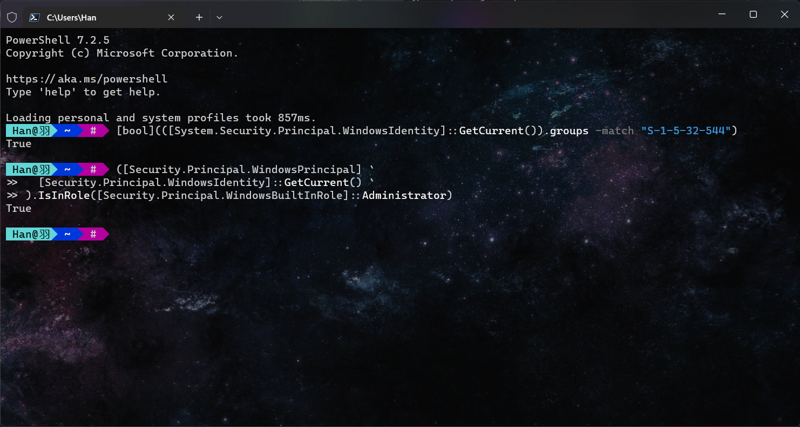

- [检测Windows Power Shell是否以管理员身份运行](#检测windows-power-shell是否以管理员身份运行)
- [使用easy-graph将GDL描述文件转换成pdf(Linux)](#使用easy-graph将gdl描述文件转换成pdflinux)
- [Hyper-V中Ubuntu开启增强会话](#hyper-v中ubuntu开启增强会话)
- [Ubuntu中安装Mysql 8](#ubuntu中安装mysql-8)
  - [完全删除](#完全删除)
  - [安装](#安装)
- [在Windows中遇到端口占用](#在windows中遇到端口占用)
  - [查找占用端口程序](#查找占用端口程序)
  - [通过上面的方法找不到占用端口程序](#通过上面的方法找不到占用端口程序)

## 检测Windows Power Shell是否以管理员身份运行

```shell
# 方法一
$ [bool](([System.Security.Principal.WindowsIdentity]::GetCurrent()).groups -match "S-1-5-32-544")

# 方法二
$ ([Security.Principal.WindowsPrincipal] `
  [Security.Principal.WindowsIdentity]::GetCurrent() `
).IsInRole([Security.Principal.WindowsBuiltInRole]::Administrator)

# 输出true即为在管理员身份下运行
```



## 使用easy-graph将GDL描述文件转换成pdf(Linux)

```shell
# 1.安装graphviz
$ sudo apt-get install graphviz

# 2.安装easy-graph
# $ sudo cpan Graph:Easy
$ wget https://cpan.metacpan.org/authors/id/S/SH/SHLOMIF/Graph-Easy-0.76.tar.gz
$ tar xvzf Graph-Easy-0.76.tar.gz
$ cd Graph-Easy-0.76
# 编译
$ perl Makefile.PL
# 报错，说是缺少Module::Install, 安装
# $ sudo pacman -S perl-module-install
# $ perl Makefile.PL
$ make test
$ sudo make install

# 3.转换为.dot文件
$ graph-easy --input=test.gdl --as_dot -o test.dot

# 4.生成pdf
$ dot -Tpdf test.dot -o test.pdf
```

## Hyper-V中Ubuntu开启增强会话

仓库fork自[https://github.com/Hinara/linux-vm-tools](https://github.com/Hinara/linux-vm-tools)

使用gitee是方便安装完成后无VPN时clone

```shell
# Linux中命令
$ git clone https://gitee.com/Iridescent-9/linux-vm-tools.git
$ cd linux-vm-tools/ubuntu
$ ls # 选择对应版本并进入
$ sudo chmod +x install.sh
$ sudo ./install.sh
```

```shell
# Windows Power Shell中命令
$ Set-VM -VMName <your_vm_name>  -EnhancedSessionTransportType HvSocket
# 重启虚拟机
```

## Ubuntu中安装Mysql 8

### 完全删除

```shell
# 删除mysql前 先删除一下 /var/lib/mysql 还有 /etc/mysql
$ sudo rm /var/lib/mysql/ -R
$ sudo rm /etc/mysql/ -R
$ sudo apt-get autoremove mysql-server mysql-common --purge
$ sudo apt-get remove apparmor

# 清理残余数据
$ sudo dpkg -l | grep ^rc | awk '{print $2}' | sudo xargs dpkg -P
```

### 安装

```shell
$ sudo apt-get install mysql-server mysql-common -y

# 安装完成后查看MySQL状态
$ sudo systemctl status mysql
● mysql.service - MySQL Community Server
     Loaded: loaded (/lib/systemd/system/mysql.service; enabled; vendor preset: enabled)
     Active: active (running) since Wed 2022-03-30 22:59:20 CST; 18min ago
    Process: 1788677 ExecStartPre=/usr/share/mysql/mysql-systemd-start pre (code=exited, status=0/SUCCESS)
   Main PID: 1788702 (mysqld)
     Status: "Server is operational"
      Tasks: 38 (limit: 2264)
     Memory: 363.8M
     CGroup: /system.slice/mysql.service
             └─1788702 /usr/sbin/mysqld

Mar 30 22:59:19 VM-16-10-ubuntu systemd[1]: Starting MySQL Community Server...
Mar 30 22:59:20 VM-16-10-ubuntu systemd[1]: Started MySQL Community Server.

# 安装完mysql-server 会提示可以运行mysql_secure_installation。运行mysql_secure_installation会执行几个设置：
# --为root用户设置密码
#--删除匿名账号
# --取消root用户远程登录
# --删除test库和对test库的访问权限
# --刷新授权表使修改生效

$ sudo mysql_secure_installation

NOTE: RUNNING ALL PARTS OF THIS SCRIPT IS RECOMMENDED FOR ALL MySQL
SERVERS IN PRODUCTION USE! PLEASE READ EACH STEP CAREFULLY!
In order to log into MySQL to secure it, we will need the current
password for the root user. If you have just installed MySQL, and
you have not set the root password yet, the password will be blank,
so you should just press enter here.
Enter current password for root (enter for none):<–初次运行直接回车
OK, successfully used password, moving on…
Setting the root password ensures that nobody can log into the MySQL
root user without the proper authorisation.
Set root password? [Y/n]    #是否设置root用户密码，输入y并回车或直接回车
New password:               #设置root用户的密码
Re-enter new password:      #再输入一次你设置的密码
Password updated successfully!
Reloading privilege tables..
… Success!
By default, a MySQL installation has an anonymous user, allowing anyone
to log into MySQL without having to have a user account created for
them. This is intended only for testing, and to make the installation
go a bit smoother. You should remove them before moving into a
production environment.
Remove anonymous users? [Y/n]   #是否删除匿名用户,生产环境建议删除，所以直接回车
… Success!
Normally, root should only be allowed to connect from 'localhost'. This
ensures that someone cannot guess at the root password from the network.
Disallow root login remotely? [Y/n] #是否禁止root远程登录,根据自己的需求选择Y/n并回车
… Success!
By default, MySQL comes with a database named 'test' that anyone can
access. This is also intended only for testing, and should be removed
before moving into a production environment.
Remove test database and access to it? [Y/n] #是否删除test数据库,直接回车
- Dropping test database…
… Success!
- Removing privileges on test database…
… Success!
Reloading the privilege tables will ensure that all changes made so far
will take effect immediately.
Reload privilege tables now? [Y/n] #是否重新加载权限表，直接回车
… Success!
Cleaning up…
All done! If you have completed all of the above steps, your MySQL
installation should now be secure.
Thanks for using MySQL!

# 可能无法正常登录MySQL 即:
$ sudo mysql -u root -p
Enter password:
ERROR 1698 (28000): Access denied for user 'root'@'localhost'

# 使用内置用户登录
$ sudo cat /etc/mysql/debian.cnf
# Automatically generated for Debian scripts. DO NOT TOUCH!
[client]
host     = localhost
user     = debian-sys-maint
password = <password> #此处即为密码
socket   = /var/run/mysqld/mysqld.sock
[mysql_upgrade]
host     = localhost
user     = debian-sys-maint
password = <password>
socket   = /var/run/mysqld/mysqld.sock

# 再登录
$ sudo mysql -u debian-sys-maint -p
Enter password:<password>
Welcome to the MySQL monitor.  Commands end with ; or \g.
Your MySQL connection id is 11
Server version: 8.0.28-0ubuntu0.20.04.3 (Ubuntu)

Copyright (c) 2000, 2022, Oracle and/or its affiliates.

Oracle is a registered trademark of Oracle Corporation and/or its
affiliates. Other names may be trademarks of their respective
owners.

Type 'help;' or '\h' for help. Type '\c' to clear the current input statement.

mysql>

mysql>use mysql
Reading table information for completion of table and column names
You can turn off this feature to get a quicker startup with -A

Database changed

mysql>select host, user, authentication_string from user;
+-----------+------------------+------------------------------------------------------------------------+
| host      | user             | authentication_string                                                  |
+-----------+------------------+------------------------------------------------------------------------+
| localhost | debian-sys-maint | $A$005$JSM4gmUErRAarUGcIUO9s2V5J8gyGaftRjRzuROdCg3mI0uitXd3j5DMrvLs81j |
| localhost | mysql.infoschema | $A$005$ItTRbfiuOdVpTy8mAfsuAKS1H9HmpGGk36VLmYMuwZrVBwQ7DNyaoDcro9w3zBF |
| localhost | mysql.session    | $A$005$ItTRbfiuOdVpTy8mAfsuAKS1H9HmpGGk36VLmYMuwZrVBwQ7DNyaoDcro9w3zBF |
| localhost | mysql.sys        | $A$005$ItTRbfiuOdVpTy8mAfsuAKS1H9HmpGGk36VLmYMuwZrVBwQ7DNyaoDcro9w3zBF |
| localhost | root             |                                                                        |
+-----------+------------------+------------------------------------------------------------------------+
5 rows in set (0.00 sec)

# 发现root的密码是空的,开始设置root密码
mysql>ALTER USER 'root'@'localhost' IDENTIFIED WITH mysql_native_password BY '<your password>'
Query OK, 0 rows affected (0.00 sec)
mysql> select host,user,authentication_string from user;
+-----------+------------------+------------------------------------------------------------------------+
| host      | user             | authentication_string                                                  |
+-----------+------------------+------------------------------------------------------------------------+
| localhost | debian-sys-maint | $A$005$JSM4gmUErRAarUGcIUO9s2V5J8gyGaftRjRzuROdCg3mI0uitXd3j5DMrvLs81j |
| localhost | mysql.infoschema | $A$005$ItTRbfiuOdVpTy8mAfsuAKS1H9HmpGGk36VLmYMuwZrVBwQ7DNyaoDcro9w3zBF |
| localhost | mysql.session    | $A$005$ItTRbfiuOdVpTy8mAfsuAKS1H9HmpGGk36VLmYMuwZrVBwQ7DNyaoDcro9w3zBF |
| localhost | mysql.sys        | $A$005$ItTRbfiuOdVpTy8mAfsuAKS1H9HmpGGk36VLmYMuwZrVBwQ7DNyaoDcro9w3zBF |
| localhost | root             | *l%hvA+HZ!v)8Bj^PUYWB&oPR+D)y0!sCH6ss4Ll+                              |
+-----------+------------------+------------------------------------------------------------------------+
5 rows in set (0.01 sec)

# 设置成功
mysql> exit
Bye

# 下来即可正常登录
$ sudo mysql -u root -p
Enter password:
Welcome to the MySQL monitor.  Commands end with ; or \g.
Your MySQL connection id is 11
Server version: 8.0.28-0ubuntu0.20.04.3 (Ubuntu)

Copyright (c) 2000, 2022, Oracle and/or its affiliates.

Oracle is a registered trademark of Oracle Corporation and/or its
affiliates. Other names may be trademarks of their respective
owners.

Type 'help;' or '\h' for help. Type '\c' to clear the current input statement.

mysql>

# 设置远程登录MySQL,云服务器的话需要在控制台打开3306端口
mysql> select host, user, authentication_string, plugin from user;
+-----------+------------------+------------------------------------------------------------------------+-----------------------+
| host      | user             | authentication_string                                                  | plugin                |
+-----------+------------------+------------------------------------------------------------------------+-----------------------+
| localhost | debian-sys-maint | $A$005$JSM4gmUErRAarUGcIUO9s2V5J8gyGaftRjRzuROdCg3mI0uitXd3j5DMrvLs81j | caching_sha2_password |
| localhost | mysql.infoschema | $A$005$ItTRbfiuOdVpTy8mAfsuAKS1H9HmpGGk36VLmYMuwZrVBwQ7DNyaoDcro9w3zBF | caching_sha2_password |
| localhost | mysql.session    | $A$005$ItTRbfiuOdVpTy8mAfsuAKS1H9HmpGGk36VLmYMuwZrVBwQ7DNyaoDcro9w3zBF | caching_sha2_password |
| localhost | mysql.sys        | $A$005$ItTRbfiuOdVpTy8mAfsuAKS1H9HmpGGk36VLmYMuwZrVBwQ7DNyaoDcro9w3zBF | caching_sha2_password |
| localhost | root             | *l%hvA+HZ!v)8Bj^PUYWB&oPR+D)y0!sCH6ss4Ll+                              | mysql_native_password |
+-----------+------------------+------------------------------------------------------------------------+-----------------------+
5 rows in set (0.00 sec)

# 此时无远程登录用户,需创建
mysql> create user 'root'@'%' identified by '<your password>';
Query OK, 0 rows affected (0.01 sec)

mysql> select host, user, authentication_string, plugin from user;
+-----------+------------------+------------------------------------------------------------------------+-----------------------+
| host      | user             | authentication_string                                                  | plugin                |
+-----------+------------------+------------------------------------------------------------------------+-----------------------+
| %         | root             | $A$005$+lkEH1xGl$fnnYZJmHLWNO5Yu0NlH6+v%UuICtaEUV8Sx@IAjrPDYnYOvCth2XX | caching_sha2_password |
| localhost | debian-sys-maint | $A$005$JSM4gmUErRAarUGcIUO9s2V5J8gyGaftRjRzuROdCg3mI0uitXd3j5DMrvLs81j | caching_sha2_password |
| localhost | mysql.infoschema | $A$005$ItTRbfiuOdVpTy8mAfsuAKS1H9HmpGGk36VLmYMuwZrVBwQ7DNyaoDcro9w3zBF | caching_sha2_password |
| localhost | mysql.session    | $A$005$ItTRbfiuOdVpTy8mAfsuAKS1H9HmpGGk36VLmYMuwZrVBwQ7DNyaoDcro9w3zBF | caching_sha2_password |
| localhost | mysql.sys        | $A$005$ItTRbfiuOdVpTy8mAfsuAKS1H9HmpGGk36VLmYMuwZrVBwQ7DNyaoDcro9w3zBF | caching_sha2_password |
| localhost | root             | *l%hvA+HZ!v)8Bj^PUYWB&oPR+D)y0!sCH6ss4Ll+                              | mysql_native_password |
+-----------+------------------+------------------------------------------------------------------------+-----------------------+
6 rows in set (0.00 sec)

mysql> grant all privileges on *.* to 'root'@'%';
Query OK, 0 rows affected (0.01 sec)

mysql> flush privileges;
Query OK, 0 rows affected (0.00 sec)

# 更改MySQL配置文件
$ sudo vim /etc/mysql/mysql.conf.d/mysqld.cnf
# 原始
bind-address            = 127.0.0.1
# 修改后
bind-address            = 0.0.0.0
# 重启MySQL
$ sudo service mysql restart
```

## 在Windows中遇到端口占用

### 查找占用端口程序

```shell
netstst -aon | findstr "被占用端口号"
```

例如

```shell
$ netstat -aon|findstr "1433"
TCP    0.0.0.0:1433           0.0.0.0:0              LISTENING       23052
TCP    [::]:1433              [::]:0                 LISTENING       23052
# 最后一列是占用端口的进程，可进入任务管理器查看该进程信息
```

直接结束该进程

```shell
taskkill /pid 该程序PID -t -f
```

### 通过上面的方法找不到占用端口程序

可能是被系统保留了端口（比如Hyper-V）

```shell
$ netsh interface ipv4 show excludedportrange protocol=tcp
协议 tcp 端口排除范围

开始端口    结束端口
----------    --------
      1203        1302
      1433        1433     *
      1434        1533
      1534        1633
      1789        1888
      1889        1988
      5357        5357
      5426        5426
      5796        5895
      6260        6359
     10362       10363     *
     50000       50059     *
     54235       54235
     54236       54236

* - 管理的端口排除。
```

其中部分端口即为给Hyper-V的端口，若需要的端口在上表中

1. 临时禁用Hyper-V

   ```shell
   dism.exe /Online /Disable-Feature:Microsoft-Hyper-V
   ```

2. 重启后，请保留所需端口，以便Hyper-V不会将其占用

   ```shell
   $ netsh int ipv4 add excludedportrange protocol=tcp startport=1433 numberofports=1
   # startport为开始端口号
   # numberofports为需要排除的端口数
   # 反向命令即为删除排除端口
   $ netsh int ipv4 delete excludedportrange protocol=tcp startport=1433 numberofports=1
   ```

3. 重新启用Hyper-V

   ```shell
   dism.exe /Online /Enable-Feature:Microsoft-Hyper-V /All
   ```
